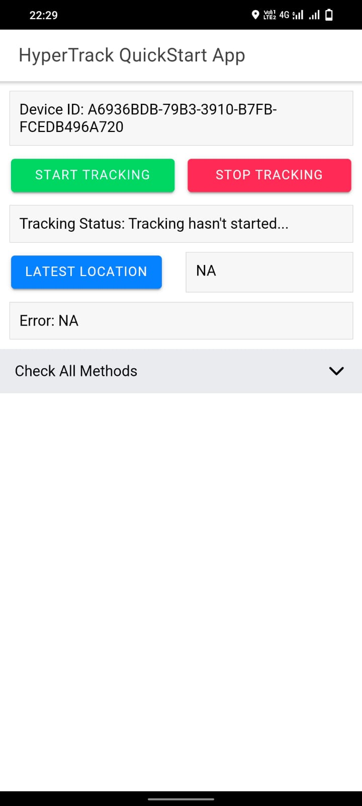
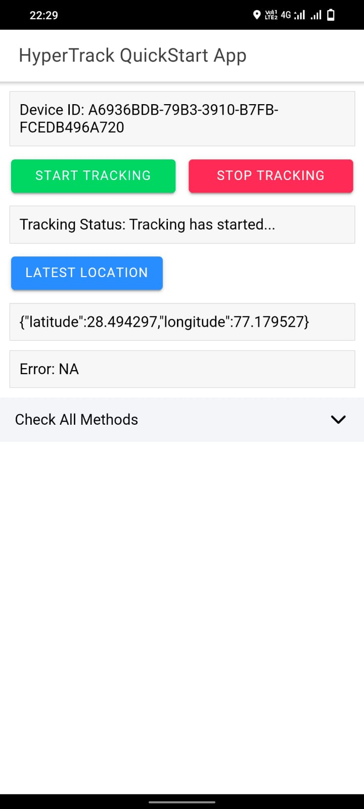

# Ionic Quickstart for Hypertrack Capacitor Plugin


[HyperTrack](https://www.hypertrack.com) lets you add live location tracking to your mobile app.
Live location is made available along with ongoing activity, tracking controls and tracking outage with reasons.
This repo contains an example ionic app that has everything you need to get started in minutes.

## Create HyperTrack Account

[Sign up](https://dashboard.hypertrack.com/signup) for HyperTrack and
get your publishable key from the [Setup page](https://dashboard.hypertrack.com/setup).

## Screenshots
<table>
<tr>
<th colspan="2">
Android
</th>
</tr>

<tr>
<td>
<p align="center">

</p>
</td>
<td>
<p align="center">

</p>
</td>
</tr>
</table>


### Set up Firebase

1. [Set up Firebase Project for quickstart-ionic-capacitor](https://console.firebase.google.com/u/0/)
2. Sign up for HyperTrack and [fill the FCM Key section in Android paragraph](https://dashboard.hypertrack.com/setup)

## Build quickstart-ionic-capacitor

Create a ionic build by [build command](https://ionicframework.com/docs/cli/commands/capacitor-build)

In order to use this plugin, please update the Gradle, AndroidManifest.xml:

In ```quickstart-ionic-capacitor/android/build.gradle``` update

```
allprojects {
    repositories {
        google()
        jcenter()
        maven {
            name 'hypertrack'
            url  'https://s3-us-west-2.amazonaws.com/m2.hypertrack.com/'
        }
    }
}
```

In ```quickstart-ionic-capacitor/android/variables.gradle``` update

```
minSdkVersion = 24
compileSdkVersion = 31
targetSdkVersion = 31
```

In ```quickstart-ionic-capacitor/android/app/src/main/AndroidManifest.xml``` update 

```
 <activity
      android:configChanges="orientation|keyboardHidden|keyboard|screenSize|locale|smallestScreenSize|screenLayout|uiMode"
      android:name="io.ionic.starter.MainActivity"
      android:label="@string/title_activity_main"
      android:theme="@style/AppTheme.NoActionBarLaunch"
      android:launchMode="singleTask"
      android:exported="true">

      <intent-filter>
          <action android:name="android.intent.action.MAIN" />
          <category android:name="android.intent.category.LAUNCHER" />
      </intent-filter>
</activity>
```
## Dashboard

Once your app is running, go to the [dashboard](https://dashboard.hypertrack.com/devices) where you can see a list of all your devices and their live location with ongoing activity on the map.

## Support
Join our [Slack community](https://join.slack.com/t/hypertracksupport/shared_invite/enQtNDA0MDYxMzY1MDMxLTdmNDQ1ZDA1MTQxOTU2NTgwZTNiMzUyZDk0OThlMmJkNmE0ZGI2NGY2ZGRhYjY0Yzc0NTJlZWY2ZmE5ZTA2NjI) for instant responses. You can also email us at help@hypertrack.com.
